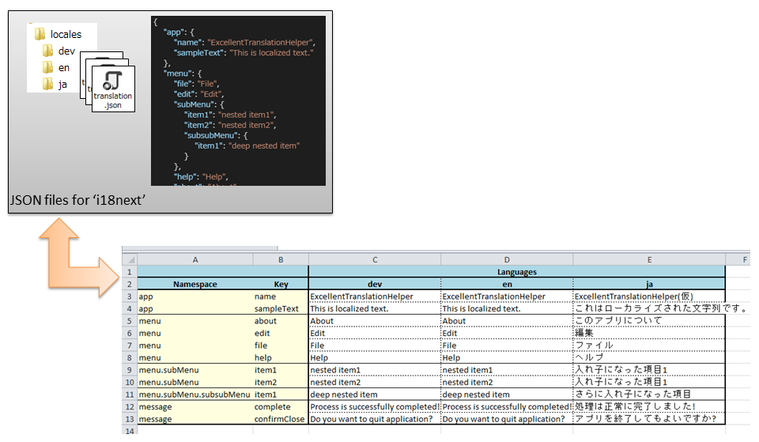

# Excellent Translation Helper

## Project Description
ExcellentTranslationHelperはi18next用のローカライズ定義ファイルとxlsx形式のエクセルシートの相互変換を行うアプリケーションです。  
This app provides mutual conversion to i18next's json files and .xlsx file.

### EXCELlent conversion!!

## 使い方

1. コンボボックスから変換の種類を選びます。(JSON⇒xlsx / xlsx⇒JSON)
2. 変換元のファイルまたはフォルダを選択します。
    1. JSON to xlsx : 変換元はフォルダとして選択します。(i18next用のJSONファイルを含んだディレクトリを指定してください。)
    2. Xlsx to JSON : 変換元は、単体のxlsxファイルとして選択します。
3. 「Convert」ボタンを押し、出力先のファイル/フォルダを指定すると、変換処理が行われます。

## How to Use

1. Select convert type by edit combobox item.
2. Open source file or directory.
   1. JSON to xlsx : select source directory
   2. Xlsx to JSON : select source .xlsx file
3. Press Convert and select output file or directory.

## Thanks
This app uses following libraries.
+ ClosedXML
+ Json.NET

+ WindowsAPICodePack